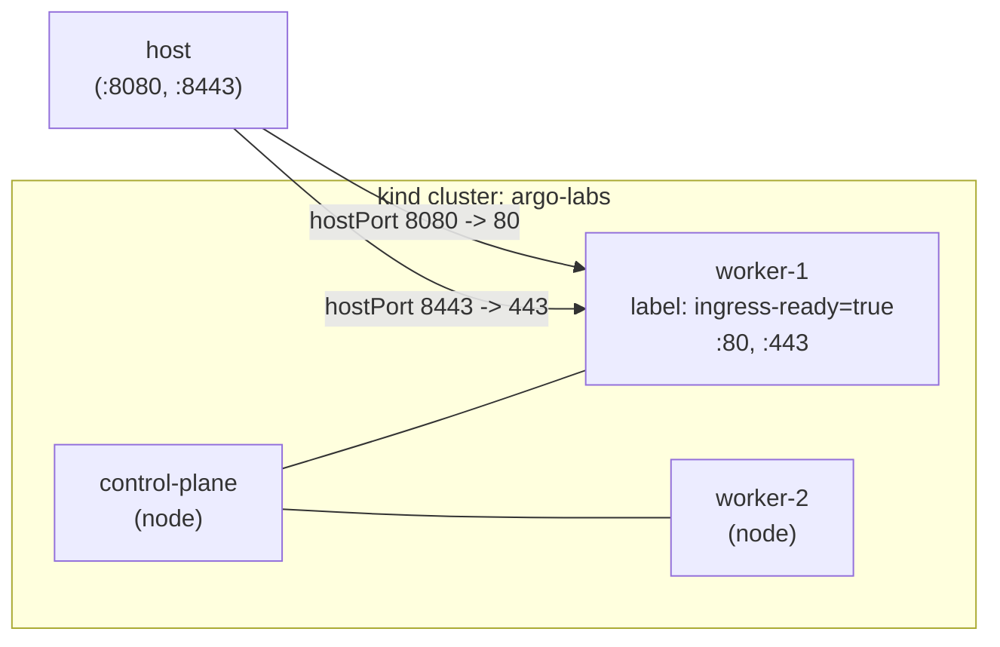

# 01 — Bootstrapping a kind cluster for the argo-labs

> Series: **argo-labs** — a hands-on journey through ArgoCD and Argo Rollouts.

## Why this lab exists

A few people have asked me how to start learning **ArgoCD** (GitOps) and **Argo Rollouts** (progressive delivery). Both are usually demoed on real clusters — which means either burning cloud spend or wrangling shared-cluster permissions. That's a rough loop for someone who's *just trying to learn*.

So I'm building a small, public lab anyone can clone and follow along with:

- Throwaway cluster on your laptop.
- Every ArgoCD/Rollouts pattern that matters, one milestone at a time.
- Tear it down when you're done; bring it back up in seconds.
- Free, offline, reproducible.

A blog post per milestone, capturing the *why*, what worked, and what broke — so you don't have to discover every pitfall yourself.

This first post is just about **getting the cluster right** — every subsequent milestone (ArgoCD install, ingress, traffic shifting, metric-gated canaries) inherits its topology and port mappings from this step. Get it wrong here and you'll be recreating the cluster mid-series.

## Why kind (and not minikube/k3d/k3s)

Short version: kind runs Kubernetes nodes as Docker containers, which is fast, cheap, and lets me model multi-node clusters realistically. The trade-offs:

| Tool | Model | Multi-node | Speed | Notes |
|---|---|---|---|---|
| **kind** | k8s-in-Docker | yes | fast | The Kubernetes project's own conformance tool. Great fit. |
| minikube | VM or container | yes | slower (VM) | More driver flexibility, more overhead. |
| k3d | k3s-in-Docker | yes | very fast | Lightweight, but k3s is a *distribution*, not vanilla k8s — small behavioral differences I'd rather avoid while learning. |

kind also has first-class support for the **ingress + extra port mappings** pattern I'll need by milestone 9, which made the choice easy.

## Topology decisions

I chose **1 control-plane + 2 workers**.



**Why two workers, not one?**
Argo Rollouts canaries are more interesting when traffic visibly splits across pods that can land on different nodes. With one worker, every pod ends up on the same kubelet — a degenerate case for understanding what's actually happening. Two is the smallest number that lets me see scheduling effects without paying for a third.

**Why the `ingress-ready=true` label and host port mappings on worker-1?**
This is the kind+ingress-nginx convention: the ingress controller will be scheduled onto the labeled node, and host ports 8080/8443 forward to that container's 80/443. I won't *use* this until I install an ingress controller (milestone 9-ish), but I'm baking it in **now** because port mappings can only be set at cluster creation. Recreating the cluster mid-series would mean re-running every previous step.

**Why 8080/8443 instead of 80/443?**
Privileged-port land mines. macOS Docker Desktop usually handles 80/443 fine, but if anything else on the host is bound to them, the cluster create silently misroutes or fails. 8080/8443 sidesteps that for the cost of typing four extra characters in URLs.

## The config

[`kind/kind-config.yaml`](../kind/kind-config.yaml):

```yaml
kind: Cluster
apiVersion: kind.x-k8s.io/v1alpha4
name: argo-labs

nodes:
  - role: control-plane
    image: kindest/node:v1.35.1

  - role: worker
    image: kindest/node:v1.35.1
    labels:
      ingress-ready: "true"
    extraPortMappings:
      - containerPort: 80
        hostPort: 8080
        protocol: TCP
      - containerPort: 443
        hostPort: 8443
        protocol: TCP

  - role: worker
    image: kindest/node:v1.35.1
```

**On the pinned `kindest/node:v1.35.1` image.** Pinning every node to an explicit Kubernetes version is the small detail that makes the difference between "works on my machine" and "works for everyone reading this post." Without a pin, kind picks a default tied to whichever kind version you installed — so a reader six months from now would silently get a different Kubernetes version, and any version-specific behavior (CRD apiVersions, deprecated fields, scheduler defaults) could drift away from what's described here. A single tag in YAML buys reproducibility cheaply.

A couple of things I deliberately left out for now:

- **Local container registry mirror.** Adds complexity and isn't needed yet. I'll come back to this when we're building app images and tired of pull rate limits — probably its own short post.
- **Custom CNI (Calico/Cilium).** kindnet is fine until we want NetworkPolicies. Not yet.

## Bringing it up

Two scripts. The up script is idempotent so I can re-run it without thinking; the down script is a one-liner for cleanup.

```bash
# from the repo root
./scripts/cluster-up.sh
```

What it does:

1. Skips create if `kind get clusters` already lists `argo-labs`.
2. Otherwise runs `kind create cluster --config kind/kind-config.yaml`.
3. Waits for all nodes to reach `Ready`.
4. Prints `cluster-info` and `get nodes -o wide`.

## Verifying it

Things I check before declaring this milestone done:

```bash
kubectl --context kind-argo-labs get nodes -o wide
# expect: 1 control-plane, 2 workers, all Ready

kubectl --context kind-argo-labs get pods -A
# expect: kube-system pods (coredns, kindnet, kube-proxy, etc.) all Running

docker ps --filter "name=argo-labs-"
# expect: 3 containers (one per node)

# Confirm worker-1 has the ingress label
kubectl --context kind-argo-labs get nodes --show-labels | grep ingress-ready
```

I should see worker-1 (whatever kind names it) carrying `ingress-ready=true` and the control-plane container exposing the API on a host port.

## What broke

Nothing on this run. `cluster-up.sh` brought up all three containers, every node went `Ready` inside the wait window, and the `kube-system` namespace was clean — coredns, kindnet, kube-proxy, and the control-plane pods all `Running`.

I'm not going to pretend that means it'll be smooth for everyone. If you hit something, the usual suspects are:

- **Host port 8080/8443 already bound** by something else on your laptop (a local nginx, Caddy, another kind cluster). `lsof -nP -iTCP:8080 -sTCP:LISTEN` will tell you. Either stop the offender or change the `hostPort` values in `kind/kind-config.yaml` and recreate the cluster.
- **Docker Desktop resource limits.** kind is happy with ~4 CPUs and 6 GB RAM for this topology. Anything less and you'll see slow node startup or kubelet flapping.
- **CoreDNS in `CrashLoopBackOff`.** Almost always a host DNS quirk being inherited into the cluster. The usual fix is a corrected `coredns` ConfigMap; if you hit it, this is one of the few times kind's [known issues page](https://kind.sigs.k8s.io/docs/user/known-issues/) is the right first stop.
- **`kindest/node:v1.35.1` not found.** If you're on an older kind release, the image tag may not exist for it. Check `kind version` and either upgrade kind or pin to a tag your version ships with.

## What I learned

A few things stuck, even from a step this small:

- **Pinning the node image earns its keep before you can see it.** Anyone reproducing this lab six months from now gets the same Kubernetes version I did. That's not glamorous, but it's the difference between a tutorial that ages well and one that quietly bit-rots.
- **Decisions you'll regret are the ones baked in at create-time.** `extraPortMappings`, node labels, and node count can't be changed without recreating the cluster. Everything else (ingress controller, CNI add-ons, ArgoCD itself) you can iterate on freely later. Worth being deliberate about the first set; everything after is cheap.
- **The 1+2 topology won't pay off until the canary milestone.** Right now the second worker is just sitting there. That's fine — I'm building it now so I don't have to recreate the cluster halfway through the series to add it.
- **Idempotent scripts are a tax you pay once.** `cluster-up.sh` checks for an existing cluster and skips create. Two extra lines, and now I can re-run it after every laptop reboot without thinking.

## What's next

**Milestone 02 — Install ArgoCD**, access the UI, understand the `Application` CRD, and connect ArgoCD to a public GitHub repo so it can start syncing manifests.

---

**Repo:** [argo-labs](https://github.com/) · **Series index:** see the README.
