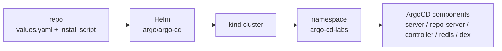

# 02 — Installing ArgoCD on kind with Helm

> Series: **argo-labs** — a hands-on journey through ArgoCD and Argo Rollouts.

## Why this step matters

The cluster from milestone 1 is just plumbing. **ArgoCD** is the first component in this lab that introduces the actual GitOps control loop: desired state in Git, a controller in the cluster, and a UI/CLI that lets me see whether those two still match.

This milestone had a modest goal on paper:

- Install ArgoCD into the kind cluster.
- Access the API/UI locally.
- Log in with the CLI.
- Inspect the `Application` CRD that ArgoCD reconciles.

In practice, this is the milestone where the lab stops being "Kubernetes on a laptop" and starts being "a GitOps environment I can actually build on."

## Why Helm instead of the raw install manifest

The upstream ArgoCD project ships a large `install.yaml`, and that is a perfectly valid way to get started. I went with the **official Helm chart** instead.

Why:

- **Version pinning is clearer.** A chart version gives me an explicit release artifact to track.
- **Overrides live in one place.** Local changes belong in a committed `values.yaml`, not in a hand-edited copy of a giant manifest.
- **Later changes are cheaper.** When I need to turn on ingress, tweak logging, or add controller configuration, Helm gives me a stable upgrade path.

That choice is reflected in this repo:

- [`scripts/argo-cd-install.sh`](../scripts/argo-cd-install.sh)
- [`platform/argo-cd/helm/values.yaml`](../platform/argo-cd/helm/values.yaml)

The install script targets the upstream `argo/argo-cd` chart and applies the local values file into the `argo-cd-labs` namespace.

## The install shape

At a high level, the flow is:



I pinned the chart to `9.5.12`, which installs ArgoCD app version `v3.4.1`. That distinction matters more than it looks:

- **Chart version** tells Helm which packaging logic and chart defaults to use.
- **App version** tells me which ArgoCD release is actually running.

If those two are not written down, future upgrades become guesswork.

## The install script

The script is intentionally small:

1. Resolve the repo root.
2. Point Helm at the committed values file.
3. Ensure the `argo-cd-labs` namespace exists.
4. Add/update the upstream Argo Helm repo.
5. Install or upgrade the release.

From the repo root:

```bash
./scripts/argo-cd-install.sh
```

The key command inside it is:

```bash
helm upgrade --install argo-cd argo/argo-cd \
  --namespace argo-cd-labs \
  --create-namespace \
  --version 9.5.12 \
  --values platform/argo-cd/helm/values.yaml
```

That is the entire installation contract for this milestone.

## Accessing the UI and CLI

ArgoCD's server defaults to TLS, so local access is easiest through a port-forward:

```bash
kubectl -n argo-cd-labs port-forward svc/argocd-server 8081:443
```

Then in another shell:

```bash
kubectl -n argo-cd-labs get secret argocd-initial-admin-secret \
  -o jsonpath='{.data.password}' | base64 -d | pbcopy
```

And log in:

```bash
argocd login localhost:8081 --insecure --username admin
```

The browser story is the same: open `https://localhost:8081`, accept the self-signed certificate warning, and log in with `admin` plus the initial secret.

## What ArgoCD actually installs

Once the chart converges, the main things I expect to see are:

- `argocd-server`
- `argocd-repo-server`
- `argocd-application-controller`
- `argocd-redis`
- `argocd-dex-server`

Those names are the first useful mental model for ArgoCD:

- The **application controller** is the reconciliation engine.
- The **repo server** pulls Git and renders manifests.
- The **server** exposes the API and UI.
- **Redis** supports internal state/caching.
- **Dex** is there for identity and SSO-oriented flows later.

This is the point where ArgoCD stops being "one thing I installed" and becomes "a small control plane with clear component boundaries."

## Verifying it

The checks I care about for this milestone:

```bash
kubectl get pods -n argo-cd-labs
kubectl get svc -n argo-cd-labs
helm list -A | grep argo-cd
kubectl explain applications.argoproj.io
kubectl get crd applications.argoproj.io -o yaml | less
```

What I want to confirm:

- The Helm release exists and is pinned to the expected chart version.
- The core ArgoCD pods are present in `argo-cd-labs`.
- The `Application` CRD exists in the cluster.
- The UI and CLI both work over the port-forward.

## What broke

One thing did break, and it was a useful one.

My first pass treated `platform/argo-cd/helm/` as if it were a full vendored chart. It wasn't. The directory had chart metadata and values, but no `templates/` tree. Helm still accepted the release, which was initially confusing:

- `helm list` showed a deployed release.
- `kubectl get all -n argo-cd-labs` showed **nothing**.

That failure mode is subtle: Helm can record release metadata even when the rendered manifest is effectively empty.

The fix was to stop pretending the local directory was the chart itself and instead use it for what it should be:

- upstream chart: `argo/argo-cd`
- local override file: `platform/argo-cd/helm/values.yaml`

That is a much better shape for this repo anyway.

## What I learned

A few things became clearer after doing this once:

- **Helm success is not the same as workload success.** If `helm list` says `deployed` but there are no pods, inspect the rendered manifest immediately.
- **Namespace naming is worth deciding early.** I used `argo-cd-labs` instead of the default `argocd`, which is slightly more verbose but makes it obvious this belongs to the lab.
- **Chart version and app version are different pieces of information.** I knew that already in theory; writing the install down made it concrete.
- **ArgoCD is best understood as components, not branding.** The controller, repo-server, and API server each have a clear job. Seeing those pods show up is the first real architectural map.

## What's next

**Milestone 03 — First "Hello GitOps" sync**: create a tiny application, register it as an ArgoCD `Application`, sync it into the cluster, then deliberately create drift and watch ArgoCD heal it.

---

**Repo:** [argo-labs](https://github.com/) · **Series index:** see the README.
