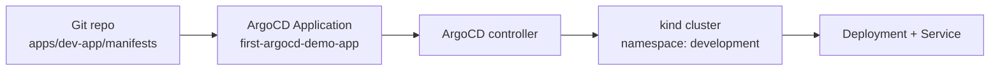

# 03 — First GitOps sync with ArgoCD

> Series: **argo-labs** — a hands-on journey through ArgoCD and Argo Rollouts.

## Why this is the real beginning

Installing ArgoCD was necessary, but it was still infrastructure work. This milestone is the first one that shows the actual GitOps loop end to end:

- manifests live in Git
- ArgoCD points at a path in the repo
- the cluster converges to that state
- manual drift becomes visible
- the controller can fix it

That last point is the one that matters. A deployment that "worked once" is not very interesting. A controller that notices when reality drifts away from Git and corrects it without drama is the whole reason to care about GitOps in the first place.

## The smallest useful app

I kept the demo intentionally boring: a single nginx deployment and a service.

Repo paths:

- [`apps/dev-app/manifests/deployment.yaml`](../apps/dev-app/manifests/deployment.yaml)
- [`apps/dev-app/manifests/service.yaml`](../apps/dev-app/manifests/service.yaml)
- [`platform/argo-cd/application/value.yaml`](../platform/argo-cd/application/value.yaml)

The app itself is not the lesson. The control loop is.

## The Application CRD is the contract

This milestone is where the `Application` CRD from milestone 2 becomes concrete.



The `Application` resource says, in effect:

- this repo is the source of truth
- this path contains the manifests
- this destination cluster/namespace should receive them
- create the namespace if it does not exist
- prune deleted resources
- self-heal drift

That is enough to turn a pile of YAML into a managed application.

## The app definition

The ArgoCD side lives here:

[`platform/argo-cd/application/value.yaml`](../platform/argo-cd/application/value.yaml)

The important parts are:

- `repoURL: https://github.com/rafaelsvieira/argo-labs`
- `targetRevision: main`
- `path: apps/dev-app/manifests`
- destination namespace `development`
- `syncOptions: CreateNamespace=true`
- automated sync with `selfHeal: true` and `prune: true`

That last block is the one to pay attention to. Without it, ArgoCD can still sync on demand, but it is not yet acting like a continuously enforcing control loop.

## Applying the Application

Once ArgoCD itself is up, the bootstrap step is straightforward:

```bash
kubectl apply -f platform/argo-cd/application/value.yaml
```

From there, ArgoCD sees the `Application`, pulls the repo, renders the path, and creates the target objects in the `development` namespace.

Useful checks:

```bash
kubectl get applications -n argo-cd-labs
argocd app get first-argocd-demo-app
kubectl get all -n development
```

If everything is wired correctly, the cluster should end up with:

- one nginx `Deployment`
- one `Service`
- a namespace that ArgoCD created automatically

## The first useful GitOps demo: drift

The easiest way to prove this is GitOps and not just "kubectl with extra steps" is to create drift on purpose.

For example:

```bash
kubectl scale deployment dev-app --replicas=3 -n development
```

At that point, reality and Git disagree:

- Git says `replicas: 1`
- the live cluster says `replicas: 3`

ArgoCD should mark the app `OutOfSync`, then because `selfHeal: true` is enabled, reconcile it back to the declared state.

That is the "aha" moment in this milestone. The deployment is no longer being managed by memory or shell history. Git is the contract, and the controller enforces it.

## Why `prune` matters too

I enabled:

```yaml
automated:
  selfHeal: true
  prune: true
```

Those two flags solve different problems:

- **self-heal** corrects drift on resources that still exist in Git
- **prune** removes resources that no longer exist in Git

If I later delete a manifest from `apps/dev-app/manifests`, I want ArgoCD to remove the corresponding live object too. Otherwise the cluster slowly accumulates leftovers and Git stops being a complete description of reality.

## Verifying it

The checks I care about for this milestone:

```bash
kubectl get applications -n argo-cd-labs
argocd app get first-argocd-demo-app
kubectl get deploy,svc -n development
kubectl describe application first-argocd-demo-app -n argo-cd-labs
```

And for the drift demo:

```bash
kubectl scale deployment dev-app --replicas=3 -n development
kubectl get deploy dev-app -n development -w
```

What I expect to observe:

- ArgoCD recognizes the app and reports it healthy/synced after initial reconciliation.
- The `development` namespace appears automatically.
- After the manual scale, the deployment eventually returns to one replica.

## What broke

Nothing substantial broke in the app sync itself, but there were two details worth noticing:

- The `Application` object lives in the ArgoCD namespace (`argo-cd-labs`), not in the target namespace (`development`). That's obvious once you know the model, but easy to get wrong on the first pass.
- `CreateNamespace=true` is doing real work here. Without it, the first sync would fail unless the destination namespace already existed.

The other lesson carried over from milestone 2: if ArgoCD itself is not really installed, app sync debugging is a waste of time. The control plane has to be unquestionably healthy first.

## What I learned

This milestone made a few GitOps ideas feel much less abstract:

- **The `Application` CRD is the unit of intent.** It is not just metadata; it is the object that connects Git, cluster, and reconciliation policy.
- **Automated sync without self-heal is incomplete.** The interesting property is not that ArgoCD can apply YAML; it is that it keeps watching afterward.
- **A tiny app is enough to demonstrate the model.** I do not need ingress, configmaps, or a real business service to understand drift and reconciliation.
- **Namespace creation is part of the deployment experience.** Eliminating that one manual prerequisite makes the demo much closer to "declare it and let the controller do the rest."

## What's next

**Milestone 04 — App-of-Apps and ApplicationSets**: one application is enough to understand the model; many applications is where the repo structure and bootstrap strategy start to matter.

---

**Repo:** [argo-labs](https://github.com/) · **Series index:** see the README.
