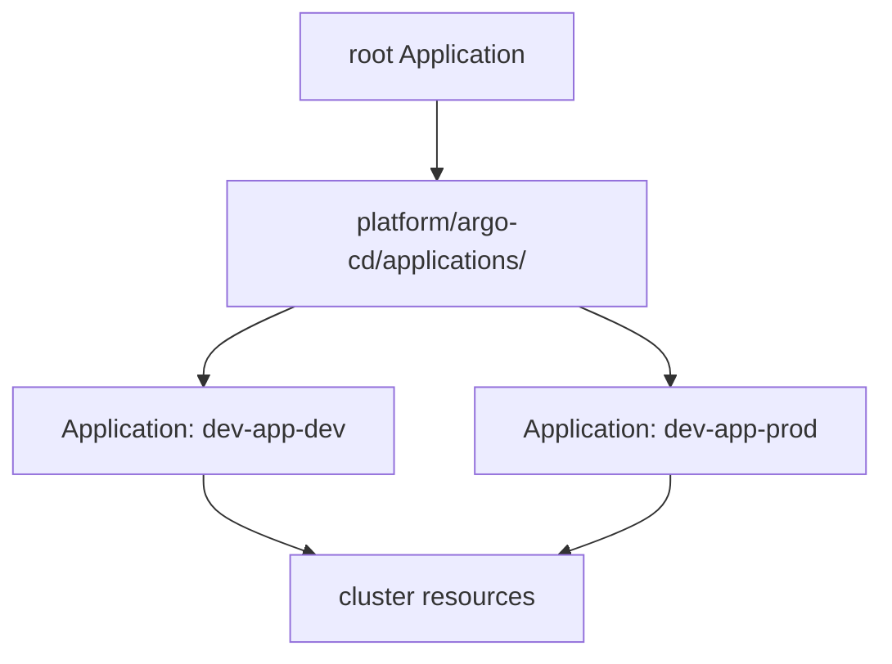
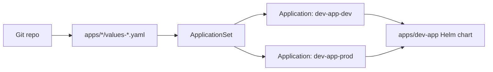

# 04 — App-of-Apps and ApplicationSets

> Series: **argo-labs** — a hands-on journey through ArgoCD and Argo Rollouts.

## Why this milestone exists

One `Application` is enough to understand GitOps. It is not enough to manage a real repo for very long.

The minute I wanted the same demo app in multiple environments, the shape of the repo started to matter more than the app itself:

- where should app definitions live?
- how many `Application` objects do I want to hand-write?
- when does "copy one more YAML file" stop being reasonable?

This is the milestone where ArgoCD stops being "a controller that syncs a path" and becomes "a system for declaring many deployments without drowning in repetition."

## The two patterns

There are two common answers to "how do I manage lots of ArgoCD apps?"

### App-of-Apps

One parent `Application` points at a directory full of child `Application` manifests.



This pattern is simple and useful, especially for **bootstrap**:

- apply one root object once
- let ArgoCD create the rest
- keep all child app definitions in Git

The weakness is repetition. If ten child apps differ only by namespace or one value file, hand-authoring ten nearly identical `Application` manifests gets old quickly.

### ApplicationSet

An `ApplicationSet` is a generator for `Application` resources.

Instead of writing each child `Application` yourself, you define:

- where inputs come from
- how to template them into ArgoCD `Application`s

That is the better fit once the difference between apps is mostly data.

## Why I moved to ApplicationSet here

I did not need fifty different services to hit the scaling problem. One service deployed to multiple environments was already enough.

The current repo shape is:

- one Helm chart: [`apps/dev-app`](../apps/dev-app)
- multiple environment values files:
  - [`apps/dev-app/values-dev.yaml`](../apps/dev-app/values-dev.yaml)
  - [`apps/dev-app/values-prod.yaml`](../apps/dev-app/values-prod.yaml)
- one `ApplicationSet`:
  - [`platform/argo-cd/applications/dev-app.yaml`](../platform/argo-cd/applications/dev-app.yaml)

That `ApplicationSet` uses a **Git file generator** to scan:

```yaml
apps/*/values-*.yaml
```

Each matching values file becomes input data for a generated `Application`.

That means:

- `values-dev.yaml` becomes one ArgoCD app
- `values-prod.yaml` becomes another ArgoCD app
- both point at the same chart
- each gets its own namespace and release-specific values

This is exactly the kind of repetition `ApplicationSet` is built to remove.

## The repo shape

The important part is that I stopped treating environments as separate apps and started treating them as **parameter sets** for the same app.

`values-dev.yaml`:

```yaml
appName: dev-app
environment: dev
namespace: development
version: "dev-1.0.0"
```

`values-prod.yaml`:

```yaml
appName: dev-app
environment: prod
namespace: production
version: "dev-1.0.0"
```

That small change in thinking makes the `ApplicationSet` possible.

Instead of:

- one chart per environment
- or one copy-pasted `Application` per environment

I now have:

- one reusable chart
- one values file per environment
- one generator that turns those files into ArgoCD apps

## The ApplicationSet

The current manifest is here:

[`platform/argo-cd/applications/dev-app.yaml`](../platform/argo-cd/applications/dev-app.yaml)

Conceptually, it does this:



The generator reads the values file fields, and the template turns them into:

- app name
- destination namespace
- chart path
- Helm values file selection

This is the point where the repo starts to feel declarative in the useful way: I am declaring *inputs*, not duplicating outcomes.

## Why I did not fully switch to app-of-apps first

The original plan for this milestone was:

1. show app-of-apps
2. then refactor to `ApplicationSet`

That progression is still the right mental model, but the repo work naturally pulled toward the second half because the scaling pressure I actually hit was "same app, different environment values," not "many unrelated apps."

So the practical conclusion is:

- **App-of-apps** is the right bootstrap pattern
- **ApplicationSet** is the right multiplication pattern

Those are not rivals as much as layers:

- app-of-apps gets the control structure into the cluster
- `ApplicationSet` generates the repeated child applications underneath it

If this repo grows to several services, I would still expect to add a root `Application` later that points at `platform/argo-cd/applications/`.

## Verifying it

Things I care about checking for this milestone:

```bash
kubectl get applicationsets -n argo-cd-labs
kubectl get applications -n argo-cd-labs
argocd app list
kubectl get ns
```

What I want to see:

- one `ApplicationSet` in the ArgoCD namespace
- two generated `Application`s:
  - `dev-app-dev`
  - `dev-app-prod`
- both target namespaces created
- both apps reconciled from the same chart using different values files

This is also the milestone where reading the generated applications matters. The generator can be valid YAML and still produce something subtly wrong if the file glob, path fields, or values-file references are off.

## What broke

A few things broke, and they were exactly the sort of issues this pattern invites.

First, I tried to template a fake SHA value into the generated `Application`:

- `value: "{{ .sha }}"`

That does not work with a plain Git generator. It does not expose commit SHA as a built-in template field, and with `missingkey=error` enabled, the template fails hard. That idea had to go.

Second, I initially used the wrong path field for the Helm values file. With Go templating enabled, the Git generator's `path` is not a plain string; it is an object. Using the wrong field shape is an easy way to build an `ApplicationSet` that looks right and renders nothing useful.

Third, my first attempt treated environments as different app names rather than the same app with different values. That worked mechanically, but it was the wrong abstraction. The moment I changed that to:

- same `appName`
- different `environment`
- different `namespace`

the overall design became much cleaner.

## What I learned

This milestone made a few things sharper:

- **ApplicationSet is about removing repeated intent, not about being clever.** If the differences between deployments are just data, generating `Application`s is simpler than hand-writing them.
- **Git generators are powerful, but they are shape-sensitive.** File globs, path objects, and field names matter. Tiny template mistakes produce very confusing outcomes.
- **The scaling unit changed from app manifests to values files.** That is a better place for environment drift to live.
- **App-of-apps and ApplicationSet solve different problems.** One is bootstrap, the other is multiplication. Treating them as interchangeable hides the point of each.

## What's next

**Milestone 05 — Sync waves, hooks, and health checks**: now that ArgoCD is managing more than one deployment shape, the next useful question is ordering and lifecycle control. When things must happen in sequence, how do I teach ArgoCD the right order?

---

**Repo:** [argo-labs](https://github.com/) · **Series index:** see the README.
