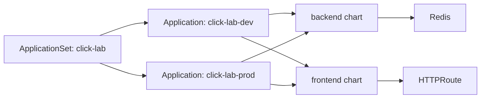

# 05 — Click Lab and Bootstrap

> Series: **argo-labs** — a hands-on journey through ArgoCD and Argo Rollouts.

## Why this milestone exists

The previous milestone made `ApplicationSet` useful by generating apps from environment data. This milestone raises the bar a bit: instead of syncing one demo chart, I wanted a small multi-service system that behaves like an application.

The app is still intentionally small, but it now has moving parts:

- a Python backend
- a Redis counter store
- an nginx frontend
- a Gateway API route
- dev and prod environment inputs

That gives the repo a better test case for GitOps patterns. It is easier to reason about sync, drift, routing, and environment configuration when the app has more than one Kubernetes object.

## The app

The click lab has two charts:

- [`apps/backend`](../apps/backend)
- [`apps/frontend`](../apps/frontend)

The backend exposes a tiny API:

- `POST /api/click` increments the count
- `POST /api/window` changes how long the count should live
- `GET /api/state` returns the count, current TTL, and configured window

Redis handles the expiration behavior. Every click resets the TTL, so the count keeps living while requests keep arriving. When the window passes without a click, Redis expires the key and the count returns to zero.

The frontend serves a small UI from nginx. It has a click button, a field for the counting window, and a short history of recent samples so I can see the state change over time.

## Why this belongs in GitOps

The interesting part is not the counter. The interesting part is the deployment shape.

The frontend and backend are separate charts, but they are part of the same application experience. I want ArgoCD to treat them as one environment-level deployment:



That is why the `click-lab` `ApplicationSet` now uses ArgoCD's multi-source application support. Each generated application points at both charts:

- backend source
- frontend source

The generated app is still one ArgoCD application per environment, but it renders both charts together.

## Environment inputs

The dev values live here:

- [`apps/backend/values-dev.yaml`](../apps/backend/values-dev.yaml)
- [`apps/frontend/values-dev.yaml`](../apps/frontend/values-dev.yaml)

The prod values live here:

- [`apps/backend/values-prod.yaml`](../apps/backend/values-prod.yaml)
- [`apps/frontend/values-prod.yaml`](../apps/frontend/values-prod.yaml)

The shape is deliberately simple:

```yaml
appName: frontend
environment: dev
namespace: click-lab-dev
version: "frontend-dev-1.0.0"
```

The important bit is that each environment gets its own namespace and values file while sharing the same chart templates.

## The ApplicationSet

The current definition is:

[`platform/argo-cd/applications/click-lab.yaml`](../platform/argo-cd/applications/click-lab.yaml)

Instead of scanning files, this version uses a list generator:

```yaml
generators:
  - list:
      elements:
        - environment: dev
          namespace: click-lab-dev
          targetRevision: develop
        - environment: prod
          namespace: click-lab-prod
          targetRevision: main
```

That makes the branch policy explicit:

- dev syncs from `develop`
- prod syncs from `main`

Then the template points each generated app at the two charts and selects the environment-specific values files:

```yaml
sources:
  - path: apps/backend/
    helm:
      valueFiles:
        - values-{{ .environment }}.yaml
  - path: apps/frontend/
    helm:
      valueFiles:
        - values-{{ .environment }}.yaml
```

This is less automatic than a Git file generator, but it is clearer for branch-per-environment behavior.

## Gateway API

The frontend is exposed through Gateway API instead of Ingress.

The shared cluster-level Gateway lives here:

[`platform/gateway-api/shared-gateway.yaml`](../platform/gateway-api/shared-gateway.yaml)

The frontend chart creates an `HTTPRoute` that attaches to that Gateway. That keeps the split clean:

- platform owns the shared Gateway
- app chart owns the route for the app

For this local lab, the Gateway class is `cloud-provider-kind`. The kind config still maps host port `8080` to container port `80`, which is enough for the current HTTP route.

## Bootstrap script

I also added a top-level start script:

[`scripts/start.sh`](../scripts/start.sh)

It chains the local bootstrap steps:

```bash
./scripts/cluster-up.sh
./scripts/argo-cd-install.sh
kubectl apply -f platform/gateway-api/shared-gateway.yaml
kubectl apply -f platform/argo-cd/applications/click-lab.yaml
kubectl apply -f platform/argo-cd/applications/dev-app.yaml
```

This is not a replacement for GitOps. It is the bootstrap edge: the small amount of imperative setup needed before ArgoCD can take over.

## Verifying it

The checks I care about for this milestone:

```bash
kubectl get applicationsets -n argo-cd-labs
kubectl get applications -n argo-cd-labs
kubectl get all -n click-lab-dev
kubectl get httproute -n click-lab-dev
kubectl get gateway -n gateway-system
```

For the app behavior:

```bash
curl http://frontend-dev.localtest.me:8080
```

And for the API directly from inside the cluster, I can port-forward or exec a temporary curl pod later if I need to debug backend state.

## What broke

The first issue was namespace drift between the generated `Application` and the Helm values. The `ApplicationSet` destination namespace and the chart values need to agree, otherwise the generated app says one thing while the rendered manifests say another.

The second issue was prod configuration. Once the list generator included a prod element, both charts needed matching `values-prod.yaml` files. Without those files, ArgoCD would try to render prod and fail before creating anything useful.

The third issue was bootstrap idempotency. Starting `cloud-provider-kind` every time is noisy if the container is already running, so the cluster script now checks first and skips the start when it can.

## What I learned

This milestone made a few tradeoffs clearer:

- **Multi-source apps are useful for small systems.** The frontend and backend can be synced as one environment without forcing them into one chart.
- **List generators are explicit.** A Git generator discovers more automatically, but a list generator makes environment-to-branch mapping easy to read.
- **Bootstrap still exists in GitOps.** ArgoCD can reconcile the app, but the cluster, ArgoCD install, and first application objects still need a controlled entry point.
- **Local Gateway API is controller-dependent.** The YAML can be valid while the local exposure behavior depends heavily on the chosen Gateway controller.

## What's next

**Milestone 06 — Secrets in GitOps**: the click lab now has enough structure to make secrets and configuration management worth exploring instead of treating them as abstract YAML examples.

---

**Repo:** [argo-labs](https://github.com/) · **Series index:** see the README.
